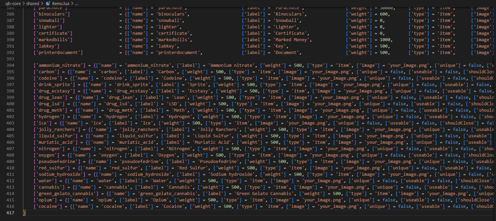

# QB-Core installation tutorial
The installation for **QB-Core** it's a bit longer than the **ESX** one where it's almost all automated

## Adding the items
To add the new items, you have to edit `qb-core/shared/items.lua` file and add at the bottom of the table the following code

```lua
	['ammonium_nitrate'] = {['name'] = 'ammonium_nitrate', ['label'] = 'Ammonium nitrate', ['weight'] = 500, ['type'] = 'item', ['image'] = 'your_image.png', ['unique'] = false, ['useable'] = false, ['shouldClose'] = false, ['combinable'] = nil},
	['carbon'] = {['name'] = 'carbon', ['label'] = 'Carbon', ['weight'] = 500, ['type'] = 'item', ['image'] = 'your_image.png', ['unique'] = false, ['useable'] = false, ['shouldClose'] = false, ['combinable'] = nil},
	['codeine'] = {['name'] = 'codeine', ['label'] = 'Codeine', ['weight'] = 500, ['type'] = 'item', ['image'] = 'your_image.png', ['unique'] = false, ['useable'] = false, ['shouldClose'] = false, ['combinable'] = nil},
	['drink_sprite'] = {['name'] = 'drink_sprite', ['label'] = 'Sprite', ['weight'] = 500, ['type'] = 'item', ['image'] = 'your_image.png', ['unique'] = false, ['useable'] = false, ['shouldClose'] = false, ['combinable'] = nil},
	['drug_ecstasy'] = {['name'] = 'drug_ecstasy', ['label'] = 'Ecstasy', ['weight'] = 500, ['type'] = 'item', ['image'] = 'your_image.png', ['unique'] = false, ['useable'] = false, ['shouldClose'] = false, ['combinable'] = nil},
	['drug_lean'] = {['name'] = 'drug_lean', ['label'] = 'Lean', ['weight'] = 500, ['type'] = 'item', ['image'] = 'your_image.png', ['unique'] = false, ['useable'] = false, ['shouldClose'] = false, ['combinable'] = nil},
	['drug_lsd'] = {['name'] = 'drug_lsd', ['label'] = 'LSD', ['weight'] = 500, ['type'] = 'item', ['image'] = 'your_image.png', ['unique'] = false, ['useable'] = false, ['shouldClose'] = false, ['combinable'] = nil},
	['drug_meth'] = {['name'] = 'drug_meth', ['label'] = 'Meth', ['weight'] = 500, ['type'] = 'item', ['image'] = 'your_image.png', ['unique'] = false, ['useable'] = false, ['shouldClose'] = false, ['combinable'] = nil},
	['hydrogen'] = {['name'] = 'hydrogen', ['label'] = 'Hydrogen', ['weight'] = 500, ['type'] = 'item', ['image'] = 'your_image.png', ['unique'] = false, ['useable'] = false, ['shouldClose'] = false, ['combinable'] = nil},
	['ice'] = {['name'] = 'ice', ['label'] = 'Ice', ['weight'] = 500, ['type'] = 'item', ['image'] = 'your_image.png', ['unique'] = false, ['useable'] = false, ['shouldClose'] = false, ['combinable'] = nil},
	['jolly_ranchers'] = {['name'] = 'jolly_ranchers', ['label'] = 'Jolly Ranchers', ['weight'] = 500, ['type'] = 'item', ['image'] = 'your_image.png', ['unique'] = false, ['useable'] = false, ['shouldClose'] = false, ['combinable'] = nil},
	['liquid_sulfur'] = {['name'] = 'liquid_sulfur', ['label'] = 'Liquid Sulfur', ['weight'] = 500, ['type'] = 'item', ['image'] = 'your_image.png', ['unique'] = false, ['useable'] = false, ['shouldClose'] = false, ['combinable'] = nil},
	['muriatic_acid'] = {['name'] = 'muriatic_acid', ['label'] = 'Muriatic Acid', ['weight'] = 500, ['type'] = 'item', ['image'] = 'your_image.png', ['unique'] = false, ['useable'] = false, ['shouldClose'] = false, ['combinable'] = nil},
	['nitrogen'] = {['name'] = 'nitrogen', ['label'] = 'Nitrogen', ['weight'] = 500, ['type'] = 'item', ['image'] = 'your_image.png', ['unique'] = false, ['useable'] = false, ['shouldClose'] = false, ['combinable'] = nil},
	['oxygen'] = {['name'] = 'oxygen', ['label'] = 'Oxygen', ['weight'] = 500, ['type'] = 'item', ['image'] = 'your_image.png', ['unique'] = false, ['useable'] = false, ['shouldClose'] = false, ['combinable'] = nil},
	['pseudoefedrine'] = {['name'] = 'pseudoefedrine', ['label'] = 'Pseudoefedrine', ['weight'] = 500, ['type'] = 'item', ['image'] = 'your_image.png', ['unique'] = false, ['useable'] = false, ['shouldClose'] = false, ['combinable'] = nil},
	['red_sulfur'] = {['name'] = 'red_sulfur', ['label'] = 'Red Sulfur', ['weight'] = 500, ['type'] = 'item', ['image'] = 'your_image.png', ['unique'] = false, ['useable'] = false, ['shouldClose'] = false, ['combinable'] = nil},
	['sodium_hydroxide'] = {['name'] = 'sodium_hydroxide', ['label'] = 'Sodium hydroxide', ['weight'] = 500, ['type'] = 'item', ['image'] = 'your_image.png', ['unique'] = false, ['useable'] = false, ['shouldClose'] = false, ['combinable'] = nil},
	['water'] = {['name'] = 'water', ['label'] = 'Water', ['weight'] = 500, ['type'] = 'item', ['image'] = 'your_image.png', ['unique'] = false, ['useable'] = false, ['shouldClose'] = false, ['combinable'] = nil},
	['cannabis'] = {['name'] = 'cannabis', ['label'] = 'Cannabis', ['weight'] = 500, ['type'] = 'item', ['image'] = 'your_image.png', ['unique'] = false, ['useable'] = false, ['shouldClose'] = false, ['combinable'] = nil},
	['green_gelato_cannabis'] = {['name'] = 'green_gelato_cannabis', ['label'] = 'Green Gelato Cannabis', ['weight'] = 500, ['type'] = 'item', ['image'] = 'your_image.png', ['unique'] = false, ['useable'] = false, ['shouldClose'] = false, ['combinable'] = nil},
	['opium'] = {['name'] = 'opium', ['label'] = 'Opium', ['weight'] = 500, ['type'] = 'item', ['image'] = 'your_image.png', ['unique'] = false, ['useable'] = false, ['shouldClose'] = false, ['combinable'] = nil},
	['cocaine'] = {['name'] = 'cocaine', ['label'] = 'Cocaine', ['weight'] = 500, ['type'] = 'item', ['image'] = 'your_image.png', ['unique'] = false, ['useable'] = false, ['shouldClose'] = false, ['combinable'] = nil},
```

### Screenshot example:
[](qb_core_items_example.jpg)

## Installing ESX menu
To make the script works, you need to install ESX menu

This esx_menu_default script is edited by the creator of QB-Core framework, you can find it in QBCore Discord server in conversion channel, or directly from this [link](https://cdn.discordapp.com/attachments/837369580921552936/915519378852810762/esx_menu_default.rar)

Be sure to add it in server.cfg auto start